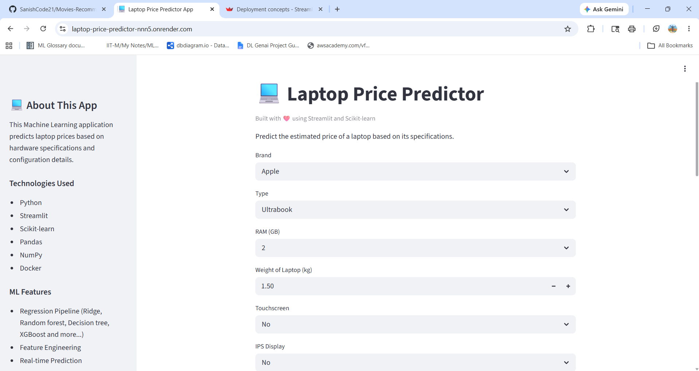
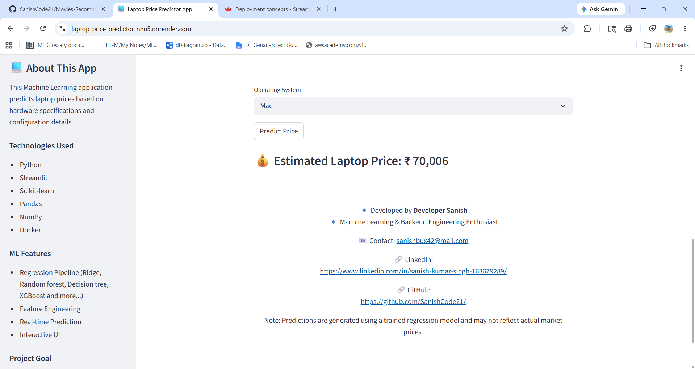
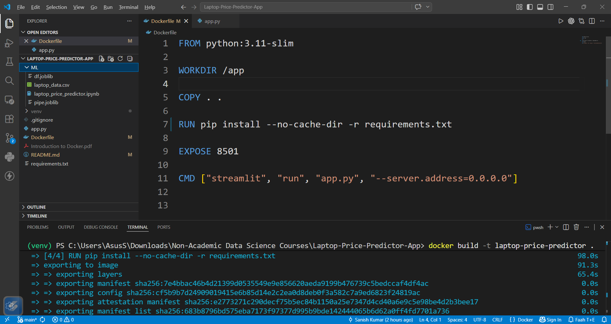
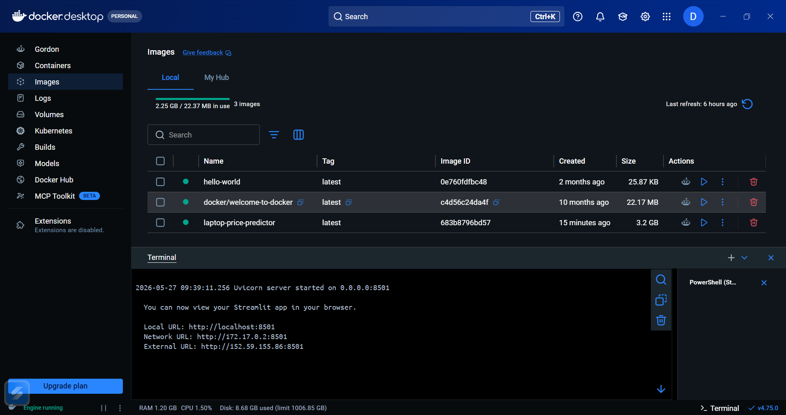
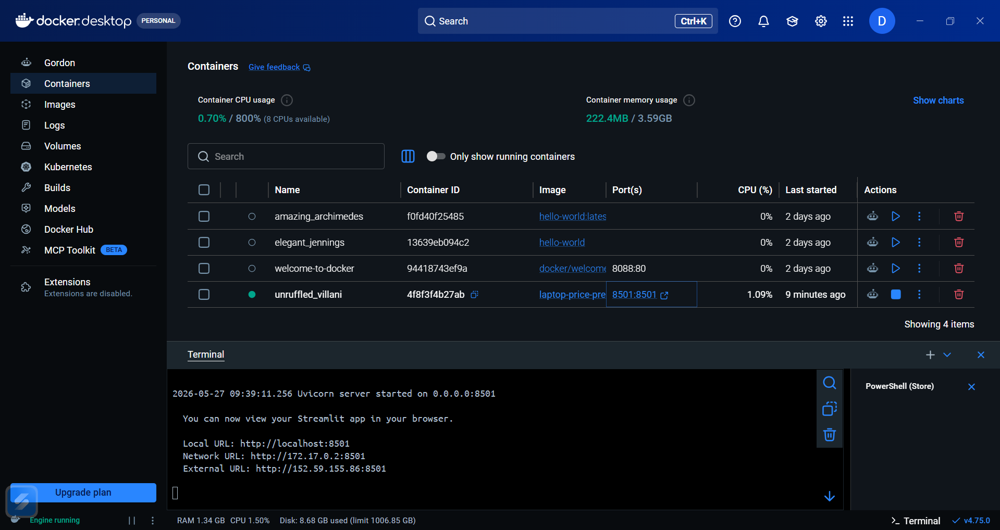

# 💻 Laptop Price Predictor App

A Machine Learning web application that predicts laptop prices based on hardware specifications and configuration details.

This project was built as part of my learning journey in Machine Learning and deployment-oriented application development. The application uses a trained regression model along with a simple and interactive Streamlit frontend for real-time predictions.

---

## Features

- Predict laptop prices based on user specifications
- Interactive Streamlit UI
- Machine Learning regression pipeline
- Real-time prediction generation
- Clean and beginner-friendly project structure

---

## Machine Learning Workflow

The project follows a complete ML workflow:

1. Data Cleaning & Preprocessing
2. Feature Engineering
3. Exploratory Data Analysis
4. Model Training
5. Regression Pipeline Creation
6. Model Serialization using Joblib
7. Frontend Integration with Streamlit

---

## Tech Stack

### Machine Learning
- Python
- Pandas
- NumPy
- Scikit-learn

### Frontend
- Streamlit

### Model Serialization
- Joblib

---

## 🐳 Docker Support

This application is fully Dockerized for consistent development and deployment workflows.

### Build Docker Image

```bash
docker build -t laptop-price-predictor .
```

### Run Docker Container

```bash
docker run -p 8501:8501 laptop-price-predictor
```

After running the container, open:

```bash
http://localhost:8501
```

### Docker Hub Image

The application image is also available on Docker Hub:

```bash
docker pull developersanish/laptop-price-predictor
```

Run directly using:

```bash
docker run -p 8501:8501 developersanish/laptop-price-predictor
```

---

## Deployment

The application is successfully deployed publicly using:

* Render
* Docker
* GitHub Integration

### 🌍 Live Application

https://laptop-price-predictor-nnn5.onrender.com/

The deployment workflow includes:

```text
GitHub Repository
        ↓
Render Deployment
        ↓
Docker Build Process
        ↓
Live Public Application
```

---

## 📸 Application Screenshots

| Desktop |
|---------|
|  |
|  |
|  |
|  |
|  |

---

## Deployment & Production Concepts Learned

Through this project, I explored several practical concepts including:

* Docker containerization
* Docker image creation
* Docker Hub workflows
* Cloud deployment using Render
* Production-style ML application setup
* Environment isolation using Docker
* Public application hosting

---

## Project Links

### GitHub Repository

https://github.com/SanishCode21/

### Docker Hub

https://hub.docker.com/r/developersanish/laptop-price-predictor

### Live Demo

https://laptop-price-predictor-nnn5.onrender.com/

## Project Structure

```bash
laptop-price-predictor/
│
├── app.py
├── ML
|   ├── pipe.joblib
|   ├── laptop_price_predictor.ipynb
|   └── df.joblib
├── assets
|   ├── img1.png
|   ├── img2.png
|   └── img3.png
├── requirements.txt
├── .gitignore
└── README.md
```

---

## Installation & Setup

### 1. Clone the Repository

```bash
git clone https://github.com/SanishCode21/Laptop-Price-Predictor-App.git

cd laptop-price-predictor
```

---

### 2. Create Virtual Environment

```bash
python -m venv venv
```

---

### 3. Activate Virtual Environment

#### Windows

```bash
venv\Scripts\activate
```

#### Linux / Mac

```bash
source venv/bin/activate
```

---

### 4. Install Dependencies

```bash
pip install -r requirements.txt
```

---

### 5. Run the Application

```bash
streamlit run app.py
```

---

## Input Features

The model predicts laptop prices using features such as:

- Brand
- Laptop Type
- RAM
- Weight
- Touchscreen Support
- IPS Display
- Screen Size
- Screen Resolution
- CPU Brand
- HDD Storage
- SSD Storage
- GPU Brand
- Operating System

---

## Learning Objectives

This project helped me understand:

- End-to-end ML workflow
- Regression model pipelines
- Model deployment basics
- Frontend integration with ML models
- Real-world feature preprocessing
- User interaction handling in Streamlit

---

## Future Improvements

Planned improvements for future versions:

- Docker containerization
- Cloud deployment
- Better UI/UX
- Model performance optimization
- API integration using FastAPI
- CI/CD pipeline integration

---

## Note

This project was built primarily for learning and experimentation purposes to strengthen my understanding of Machine Learning application development and deployment workflows.

---

## 👨‍💻 Author

Sanish Kumar

`Aspiring ML Engineer | Full-Stack Developer`

`Focused on Full-Stack developement, ML, DL, GenAI and scalable systems`


- Email: ***sanishbux42@gmail.com***
- Linkedin: https://www.linkedin.com/in/sanish-kumar-singh-163679289
- Kaggle Notebook: https://www.kaggle.com/code/sanishkumarsingh/
- Colab project Notebook: https://colab.research.google.com/drive/1rK_NX1T4vKWqY3VscXz5owYEXVh2LcCy?usp=sharing


If you found this project helpful or interesting, feel free to connect or provide feedback.
